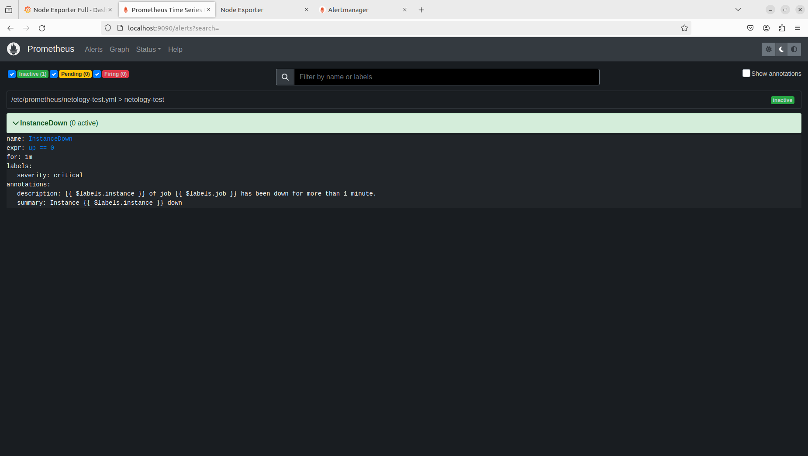
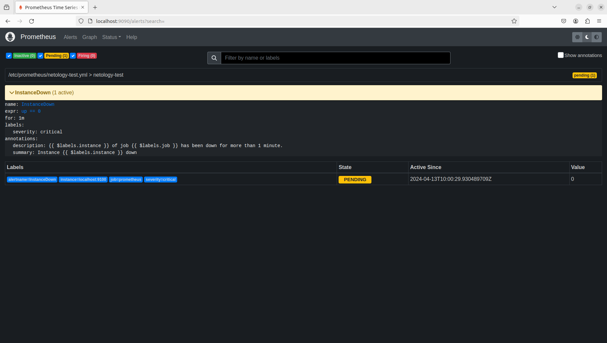
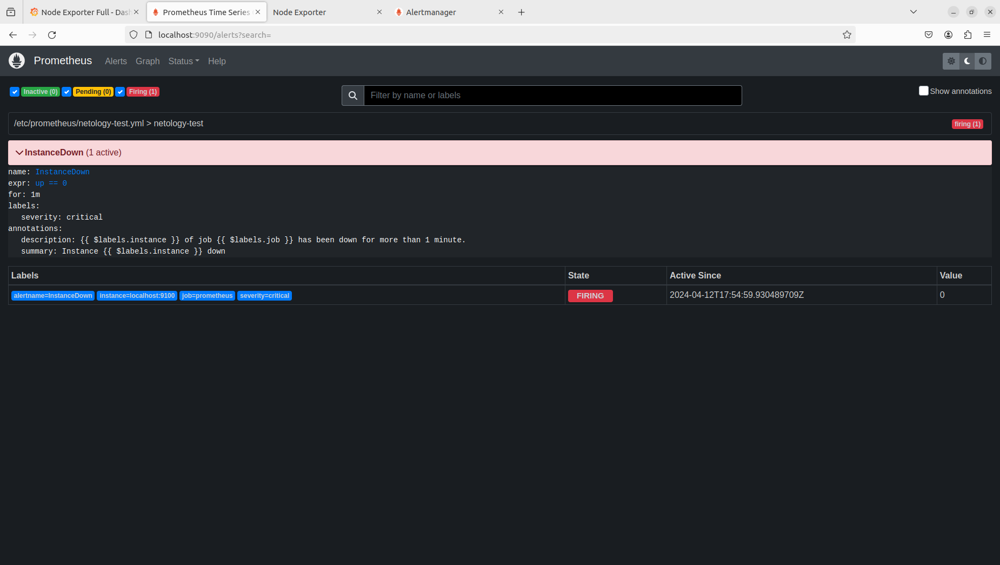
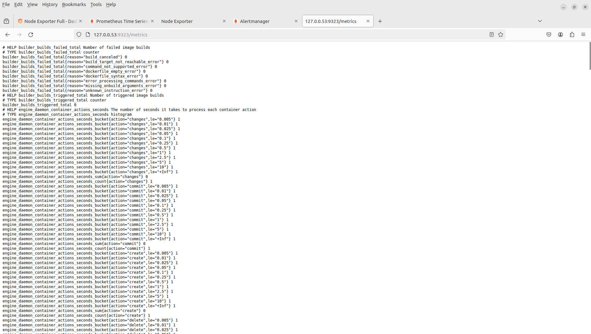
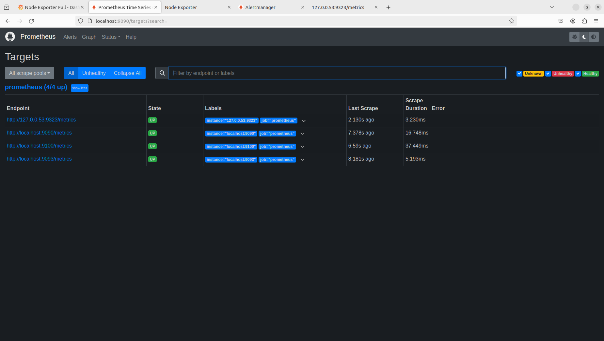

# Домашнее задание к занятию «Prometheus. Часть 2» "Макарцев Александр Вадимирович"

Это задание для самостоятельной отработки навыков и не предполагает обратной связи от преподавателя. Его выполнение не влияет на завершение модуля. Но мы рекомендуем его выполнить, чтобы закрепить полученные знания.

### Цели задания
1. Научитья настраивать оповещения в Prometheus
2. Научиться устанавливать Alertmanager и интегрировать его с Prometheus
3. Научиться активировать экспортёр метрик в Docker и подключать его к Prometheus.
4. Научиться создавать дашборд Grafana

---

### Задание 1*
Создайте файл с правилом оповещения, как в лекции, и добавьте его в конфиг Prometheus.

### Требования к результату
- [ ] Погасите node exporter, стоящий на мониторинге, и прикрепите скриншот раздела оповещений Prometheus, где оповещение будет в статусе Pending

#### Решение

---

### Задание 2*
Установите Alertmanager и интегрируйте его с Prometheus.

### Требования к результату
- [ ] Прикрепите скриншот Alerts из Prometheus, где правило оповещения будет в статусе Fireing, и скриншот из Alertmanager, где будет видно действующее правило оповещения

#### Решение

---

### Задание 3*

Активируйте экспортёр метрик в Docker и подключите его к Prometheus.

### Требования к результату
- [ ] приложите скриншот браузера с открытым эндпоинтом, а также скриншот списка таргетов из интерфейса Prometheus.*

#### Решение

---

### Задание 4* со звездочкой 

Создайте свой дашборд Grafana с различными метриками Docker и сервера, на котором он стоит.

### Требования к результату
- [ ] Приложите скриншот, на котором будет дашборд Grafana с действующей метрикой

## Критерии оценки
1. Выполнено минимум 3 обязательных задания
2. Прикреплены требуемые скриншоты
3. Задание оформлено в шаблоне с решением и опубликовано на GitHub